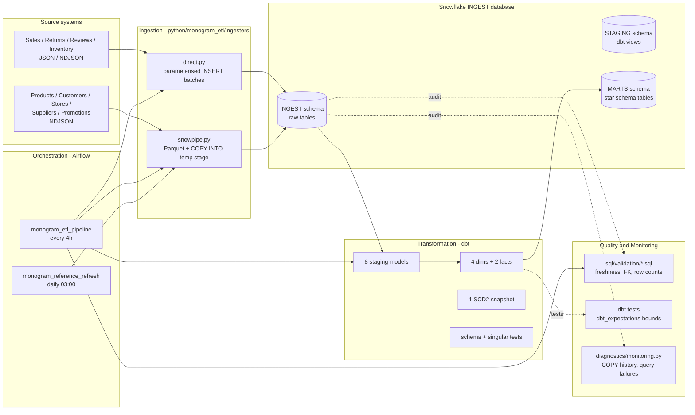
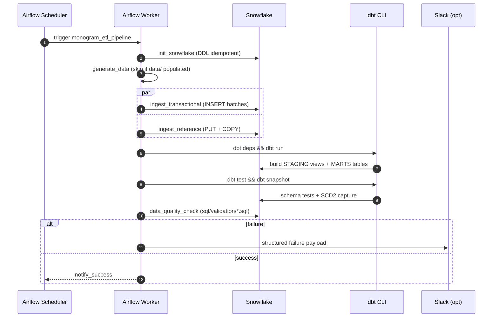

# Architecture

End-to-end view of the Monogram Paris ETL: ingestion, orchestration, transformation, quality, monitoring.

## 1. High-level flow



## 2. Two-path ingestion — why?

| Aspect | Direct ingester | Snowpipe ingester |
|--------|-----------------|-------------------|
| **Source data** | Transactional events (sales, returns, reviews, inventory) | Master / reference data (products, customers, stores, suppliers, promotions) |
| **Volume** | High (~100k sales/run) | Low (5k products, 10k customers — change rarely) |
| **Latency target** | Near real-time (4-hour SLA) | Daily |
| **Mechanism** | `executemany()` parameterised INSERTs | Pandas → PyArrow → Parquet → `PUT` to TEMP STAGE → `COPY INTO` |
| **Trade-off** | Low setup, higher per-row cost | Higher setup (stages, file format), much cheaper at scale |
| **Failure mode** | One bad row poisons the batch — see [`docs/ERROR_HANDLING.md`](ERROR_HANDLING.md) | Stages can leak if `DROP STAGE` fails; cleaned by `monogram-check` |

Either path can scale to true Snowpipe REST / Kafka in the future without rewriting downstream code, because both write into the same `INGEST.INGEST.*` raw tables.

## 3. Orchestration — Airflow DAG topology

`monogram_etl_pipeline` (every 4 hours):

```
start
  └─► init_snowflake (DDL idempotent)
        └─► generate_data (skip if data/ populated)
              └─► [ingest_transactional, ingest_reference]   (TaskGroup, parallel)
                    └─► dbt_deps
                          └─► dbt_run
                                ├─► dbt_test           (schema.yml + singular)
                                ├─► dbt_snapshot       (SCD2 on dim_customer)
                                └─► data_quality_check (sql/validation/*.sql)
                                       └─► notify_success
```

`monogram_reference_refresh` (daily, 03:00 UTC): a smaller DAG that only refreshes the master-data tables on a relaxed SLA.

Retry policy: 3 attempts with exponential backoff (2m → 4m → 8m, capped at 30m). SLA: 30 min per task. Execution timeout: 45 min. Failure callback writes a structured log line and optionally posts to `SLACK_WEBHOOK_URL`.

## 4. Transformation — dbt layers

```
INGEST  (raw, populated by Python)
   │
   ▼
STAGING (dbt views — type casting, renames, drop-bad-rows)
   │
   ▼
MARTS   (dbt tables — conformed dimensions + facts)
```

The mart layer is the analyst-facing surface. See [`docs/DATA_MODEL.md`](DATA_MODEL.md) for the star schema.

## 5. Quality strategy — three layers

1. **dbt schema tests** — `not_null` / `unique` on every PK, `relationships` on every FK between facts and dims, `accepted_values` on enum-like columns. Runs on every `dbt build`.
2. **dbt_expectations** — numeric and date bounds (`expect_column_values_to_be_between`). Catches drift in distributions, not just nulls.
3. **Operational SQL assertions** — `sql/validation/assert_*.sql` files invoked by the Airflow `data_quality_check` task. Cover freshness (loaded_at vs SLA), referential integrity in the *raw* layer (before staging filters anything out), and row-count bounds (vs the configured generator output).

A failure in any of these fails the DAG run.

## 6. Monitoring

Two slices:

- **Business quality** — `dbt build` test results, exit code, breach list. Aggregated by Airflow.
- **Operational health** — `python/monogram_etl/diagnostics/monitoring.py` queries `SNOWFLAKE.ACCOUNT_USAGE.COPY_HISTORY` and `QUERY_HISTORY` for the past 24 h. Surfaces per-table COPY failures, query incidents, and ingestion lag.

See [`docs/MONITORING.md`](MONITORING.md) for the full per-component matrix and alert thresholds.

## 7. Tech stack rationale

| Choice | Why | Alternative considered |
|--------|-----|------------------------|
| Snowflake | Course requirement; separation of compute / storage; QUERY_HISTORY is great for monitoring | BigQuery, Redshift, ClickHouse |
| Two ingestion paths | Transactional vs reference data have very different cost profiles | One unified Kafka stream — overkill for the data volume |
| Airflow | Industry standard; rich operator ecosystem; native scheduling + retry | Dagster (more modern), Prefect (lighter) — Airflow won on familiarity for the jury |
| dbt | SQL-first, version-controlled transformations + tests for free; conformed dims is the textbook luxury-retail pattern | Custom SQL scripts (worse testing), Spark (overkill) |
| dbt_expectations | Adds Great Expectations–style assertions without a second runtime | Standalone Great Expectations (heavier, duplicated infra) |
| Key-pair auth | Snowflake recommendation; no password rotation churn | Username/password (less secure) |
| pyproject.toml + console_scripts | Single source of truth for deps + CLI entry points | requirements.txt only (lose entry points) |

## 8. Capacity and limits

Tested locally with the generator at default settings:

| Step | Throughput |
|------|-----------|
| `monogram-generate` (Faker) | ~30 k rec/s |
| `monogram-ingest-direct` (batch 10 k) | ~5 k rec/s (network bound) |
| `monogram-ingest-snowpipe` (batch 2 k) | ~1 k rec/s (Parquet conversion bound) |
| `dbt build` (full refresh on 100 k sales) | ~45 s on a XS warehouse |

The direct ingester is the obvious next optimisation target — wrap with `monogram_etl.utils.retry` and parallelise per table.

## 9. Sequence — single end-to-end run


