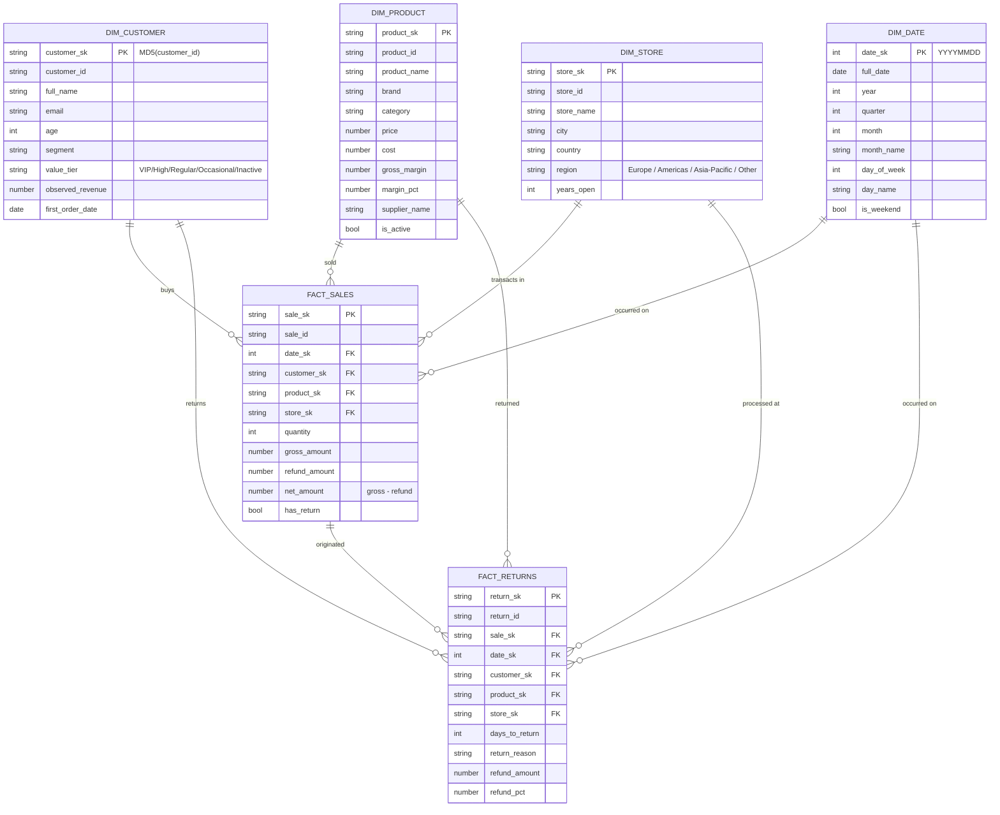

# Data model - star schema

The `INGEST.MARTS` schema is a classic Kimball star: facts surrounded by conformed dimensions. Built by dbt from the raw `INGEST.INGEST.*` tables.

## 1. ERD



## 2. Conformed dimensions

| Dimension | Grain | Surrogate key | Natural key | Notable derived attrs |
|-----------|-------|---------------|-------------|----------------------|
| `dim_customer` | one row per CRM customer | `customer_sk` = MD5(customer_id) | `customer_id` | `value_tier` (computed from observed revenue + orders), `age` (from DOB) |
| `dim_product` | one row per product | `product_sk` | `product_id` | `gross_margin`, `margin_pct`, supplier attrs joined in |
| `dim_store` | one row per store | `store_sk` | `store_id` | `region` (mapped from country), `years_open` |
| `dim_date` | one row per calendar day | `date_sk` = `YYYYMMDD` | `full_date` | `is_weekend`, `quarter_start_date`, `year_start_date` |

Each dimension is rebuilt full-refresh by `dbt run`. Slowly-changing history for customers is captured separately by `dbt snapshot` (see SCD2 below).

## 3. Facts

| Fact | Grain | FKs | Additive measures | Semi-additive measures |
|------|-------|-----|-------------------|------------------------|
| `fact_sales` | one row per sale event | `date_sk`, `customer_sk`, `product_sk`, `store_sk` | `quantity`, `gross_amount`, `refund_amount`, `net_amount` | `unit_price` (averaging only with weights) |
| `fact_returns` | one row per return event | `date_sk`, `customer_sk`, `product_sk`, `store_sk`, `sale_sk` | `refund_amount` | `refund_pct`, `days_to_return` |

`fact_sales.net_amount` = `gross_amount - refund_amount` (joined from `fact_returns`). This means returns get counted twice (once as a negative-impact in `fact_sales`, once explicitly in `fact_returns`) - analysts should pick one perspective per question.

## 4. SCD2 - customer history

`dbt/snapshots/customer_snapshot.sql` captures a Type-2 history of:

- `segment`
- `preferred_channel`
- `marketing_consent`
- `lifetime_value`
- `last_purchase_date`

Strategy: `check` on the columns above. `dbt snapshot` runs at the end of every DAG; only rows whose tracked fields changed get a new row.

Result lives in `INGEST.MARTS.CUSTOMER_SNAPSHOT` with columns `dbt_valid_from`, `dbt_valid_to`, plus the source columns. Joins look like:

```sql
SELECT *
FROM   INGEST.MARTS.FACT_SALES f
LEFT JOIN INGEST.MARTS.CUSTOMER_SNAPSHOT s
  ON  s.customer_id = f.customer_id
  AND f.sale_date  >= s.dbt_valid_from
  AND f.sale_date  <  COALESCE(s.dbt_valid_to, '9999-12-31')
```

## 5. Naming + conventions

- All surrogate keys end in `_sk`; all natural keys end in `_id`.
- `_at` for timestamps, `_date` for dates.
- Snake case in dbt; uppercase in raw Snowflake (Snowflake default).
- Booleans get a verb prefix (`is_active`, `has_return`, `marketing_consent`).
- Currency columns are `NUMBER(10,2)` - `gross_margin` is the dollar amount, `margin_pct` is the percentage.

## 6. Tests on the mart layer

Every PK gets `not_null + unique`. Every FK gets `relationships(to=ref('dim_X'))`. Numeric bounds use `dbt_expectations.expect_column_values_to_be_between`. Custom singular tests (`dbt/tests/`) cover invariants that don't fit the column model:

- `assert_fact_sales_amount_consistency` - `net_amount` must equal `gross_amount - refund_amount`, and none of them may be negative.
- `assert_no_future_dated_sales` - `sale_date <= current_date()`.

See `dbt/models/marts/schema.yml` for the full declaration.

## 7. Volume expectations (default generator config)

| Table | Rows | Update frequency |
|-------|------|------------------|
| `dim_customer` | ~10 000 | weekly |
| `dim_product` | ~5 000 | weekly |
| `dim_store` | ~20 | quarterly |
| `dim_date` | ~4 000 | static (10-year span) |
| `fact_sales` | ~100 000 / generation run | every 4 hours |
| `fact_returns` | ~5 000 / generation run | every 4 hours |

These are also what `sql/validation/assert_row_count_within_bounds.sql` checks against.
