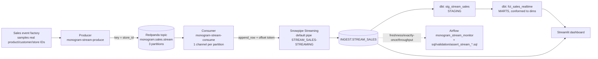

# Real-Time Streaming Layer

The streaming layer turns Monogram's sales into a continuous, real-time feed:
synthetic sale events are published to **Kafka (Redpanda)** and ingested into
**Snowflake** with **Snowpipe Streaming** (high-performance Python SDK), then
modelled by dbt and surfaced on a dashboard. It complements the batch ELT, giving
the warehouse a near-instant view of sales alongside the historical star schema.

## 1. Flow



## 2. Components

| Component | File | Role |
|-----------|------|------|
| Event factory | `python/monogram_etl/streaming/events.py` | Builds sale events sampling real product/customer/store IDs from `data/` so foreign keys resolve against the dbt dimensions |
| Producer | `python/monogram_etl/streaming/producer.py` (`monogram-stream-produce`) | Publishes events to Kafka at a configurable rate; key is `store_id` (ordered per store) |
| Broker | `docker-compose.yml` (Redpanda + Console) | Kafka-API broker, 3 partitions; Console UI at `localhost:8088` |
| Consumer | `python/monogram_etl/streaming/consumer.py` (`monogram-stream-consume`) | One Snowpipe Streaming channel per Kafka partition; the Kafka offset is the channel offset token |
| Sink | `python/monogram_etl/streaming/sink.py` | Wraps `StreamingIngestClient` / channel; writes `profile.json` from env |
| Target | `sql/ddl/03_raw_streaming.sql` (`INGEST.STREAM_SALES`) | Raw landing table; the default pipe `STREAM_SALES-STREAMING` is auto-created |
| Transform | `dbt/models/staging/stg_stream_sales.sql`, `dbt/models/marts/fct_sales_realtime.sql` | Clean view + real-time fact conformed to the same dims as `fact_sales` |
| Monitor | `dags/monogram_stream_monitor_dag.py`, `sql/validation/assert_stream_*.sql` | Freshness, exactly-once, throughput/latency every 5 minutes |
| Dashboard | `dashboard/streamlit_app.py` | Business insights + live stream panel |

## 3. Exactly-once

Snowpipe Streaming commits are tracked by an **offset token** per channel. The
consumer uses the **Kafka offset** as that token, and maps **one channel per Kafka
partition** (offsets are monotonic within a partition). On restart, the consumer
reads each channel's last committed offset and seeks Kafka to `offset + 1`, so no
event is lost or double-written. Verified: 150 events produced, 150 landed, 0
duplicate `(partition, offset)` pairs (`sql/validation/assert_stream_exactly_once.sql`
and the dbt source test `unique_combination_of_columns`).

## 4. Latency

`EVENT_TS` (when the sale happened) and `INGESTED_AT` (when the consumer landed it)
are both stored, so end-to-end latency is `INGESTED_AT - EVENT_TS`. It is exposed
as `latency_seconds` in `stg_stream_sales` / `fct_sales_realtime` and summarised by
`sql/validation/assert_stream_throughput.sql`. With producer and consumer running
together, latency is a few seconds (Snowpipe Streaming targets sub-10s ingest).

## 5. Run it

```bash
# 1. Broker
docker compose up -d                       # Redpanda + Console (localhost:8088)

# 2. Target table (once)
#    applied by the Airflow init task, or run sql/ddl/03_raw_streaming.sql

# 3. Stream (two terminals)
monogram-stream-produce --rate 20          # publish ~20 events/s
monogram-stream-consume --batch-size 50    # land them in Snowflake

# 4. Model + view
cd dbt && dbt build --select stg_stream_sales+ fct_sales_realtime
streamlit run dashboard/streamlit_app.py   # insights + live stream
```

`monogram-stream-produce --dry-run` prints events without a broker;
`monogram-stream-consume --dry-run` consumes without writing to Snowflake.

## 6. Configuration

| Env var | Default | Meaning |
|---------|---------|---------|
| `KAFKA_BOOTSTRAP_SERVERS` | `localhost:19092` | Broker (use `redpanda:9092` inside the compose network) |
| `KAFKA_SALES_TOPIC` | `monogram.sales.stream` | Topic |
| `KAFKA_CONSUMER_GROUP` | `monogram-stream-consumer` | Consumer group |
| `STREAM_TABLE` | `STREAM_SALES` | Snowflake target table (default pipe `<TABLE>-STREAMING`) |
| `STREAM_CHANNEL_PREFIX` | `monogram` | Channel name prefix (one per partition) |

Snowflake auth reuses the project's key-pair (`SNOWFLAKE_*` in `.env`); the sink
renders a `profile.json` for the Snowpipe Streaming SDK from those vars.

## 7. Error handling

- **Consumer restart:** resumes from the last Snowflake-committed offset (exactly-once), no manual reset.
- **Broker down:** the producer is idempotent and buffers; the consumer reconnects.
- **Bad rows:** server-side validation in the pipe; the monitor DAG flags drops.
- **Retries:** network calls use `python/monogram_etl/utils/retry.py` (exponential backoff).
